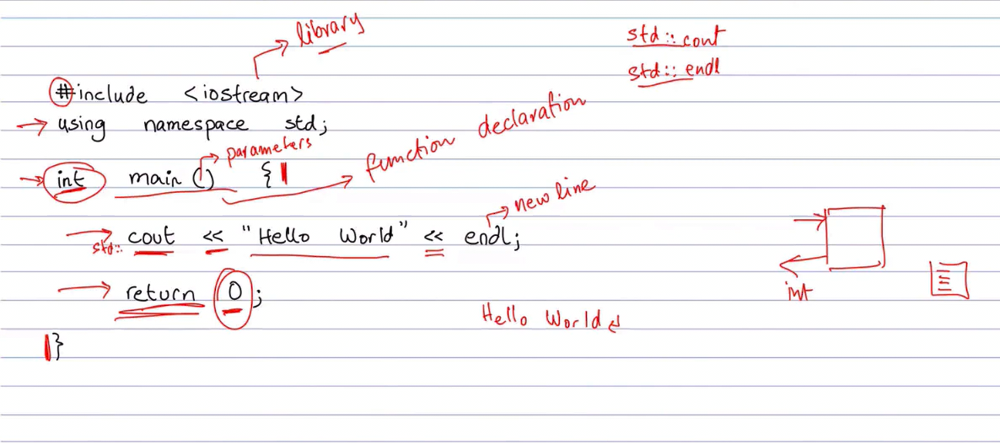
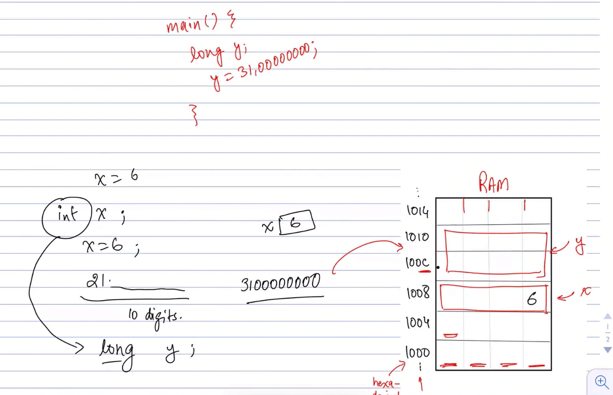
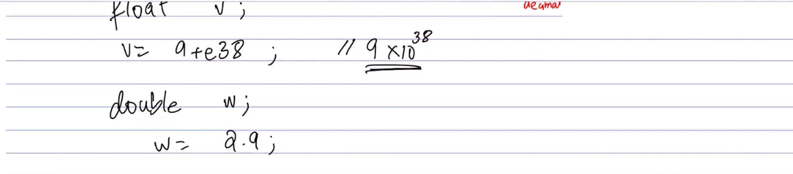
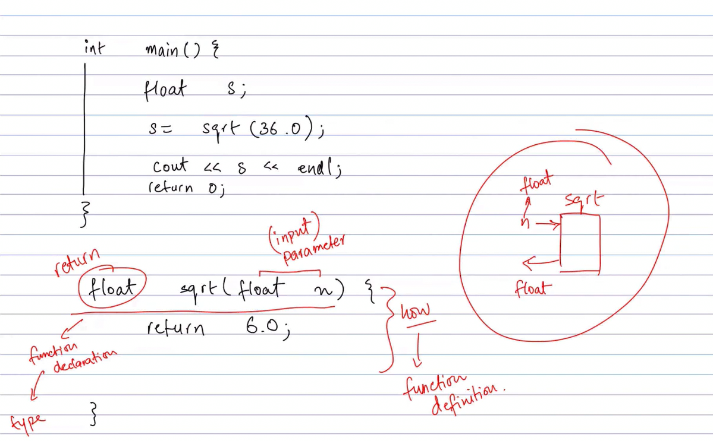
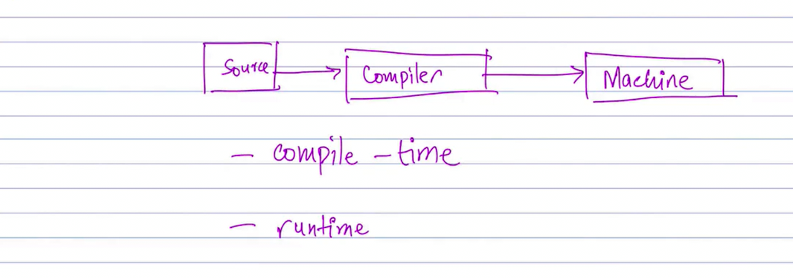

# C++ Basics: Datatypes, Functions, and Prototypes

This folder introduces the key concepts of C++ programming:

- `datatypes` for storing values
- `functions` for organizing reusable code
- `function prototypes` for declarations before use
- `compilation` and `runtime` behavior

---

## 1. Basic Introduction

A C++ program starts with `#include` directives and the `main()` function.

```cpp
#include <iostream>

int main() {
    std::cout << "Hello, C++!" << std::endl;
    return 0;
}
```

Explanation:

- `#include <iostream>` imports the input/output library.
- `int main()` is the program entry point.
- `std::cout` prints text to the console.
- `return 0;` indicates successful execution.

---



## 2. Integer Types: `int` and `long`

C++ provides integer datatypes for whole numbers.

```cpp
#include <iostream>

int main() {
    int age = 25;
    long distance = 1234567890L;

    std::cout << "Age: " << age << std::endl;
    std::cout << "Distance: " << distance << std::endl;
    return 0;
}
```

Explanation:

- `int` stores normal whole numbers, typically 32-bit.
- `long` stores larger whole numbers, useful when `int` is too small.
- Use `L` suffix for long integer literals when needed.

---



## 3. Floating-point Types: `float` and `double`

Use floating-point types for decimal values.

```cpp
#include <iostream>

int main() {
    float temperature = 36.5f;
    double pi = 3.141592653589793;

    std::cout << "Temperature: " << temperature << std::endl;
    std::cout << "Pi: " << pi << std::endl;
    return 0;
}
```

Explanation:

- `float` is a single-precision decimal type.
- `double` is a double-precision decimal type and is more accurate.
- Use `f` suffix for `float` literals.

---



## 4. Functions and Prototypes

Functions let you organize code into reusable blocks.

```cpp
#include <iostream>

// Function prototype (declaration)
int add(int a, int b);

double multiply(double x, double y);

int main() {
    int sum = add(5, 7);
    double product = multiply(2.5, 4.0);

    std::cout << "Sum: " << sum << std::endl;
    std::cout << "Product: " << product << std::endl;
    return 0;
}

// Function definition
int add(int a, int b) {
    return a + b;
}

double multiply(double x, double y) {
    return x * y;
}
```

Explanation:

- A function prototype declares the function signature before `main()`.
- `int add(int a, int b)` returns the sum of two integers.
- `double multiply(double x, double y)` returns the product of two decimals.
- Prototypes are useful when the function definition appears after `main()`.

---



## 5. Compile-time vs Runtime

C++ programs are compiled before they run.

- Compile time: source code is converted to machine code.
- Runtime: the compiled program executes and produces output.

Example compile command:

```bash
g++ main.cpp -o main
./main
```

Explanation:

- `g++ main.cpp -o main` compiles the source file into an executable named `main`.
- `./main` runs the generated program.

---



## Summary

This README covers the fundamentals of C++:

- Basic program structure
- Integer and floating-point datatypes
- Function definitions and prototypes
- The difference between compilation and runtime
