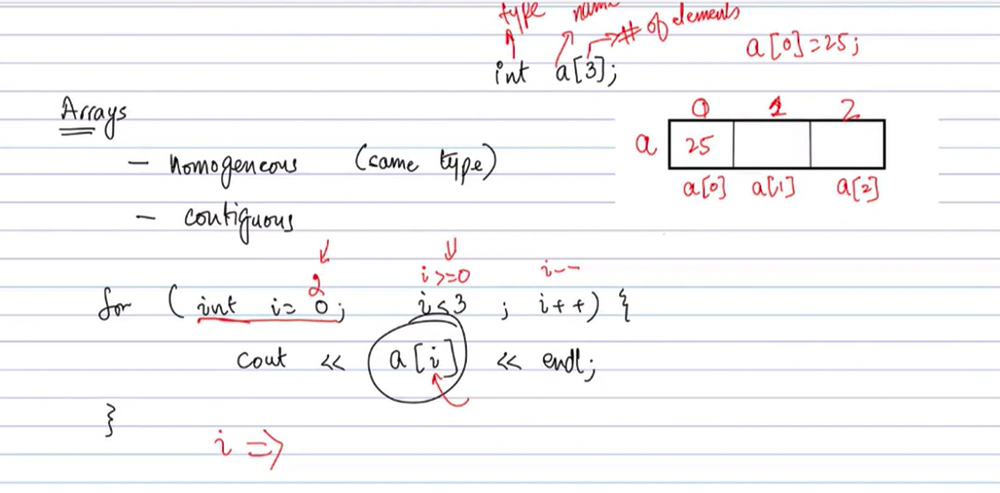
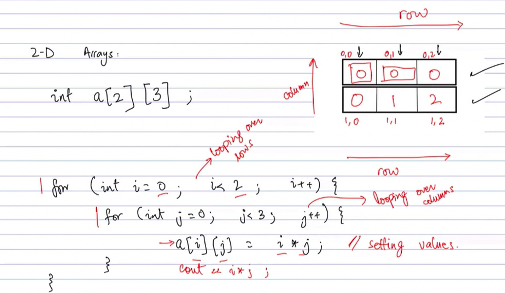
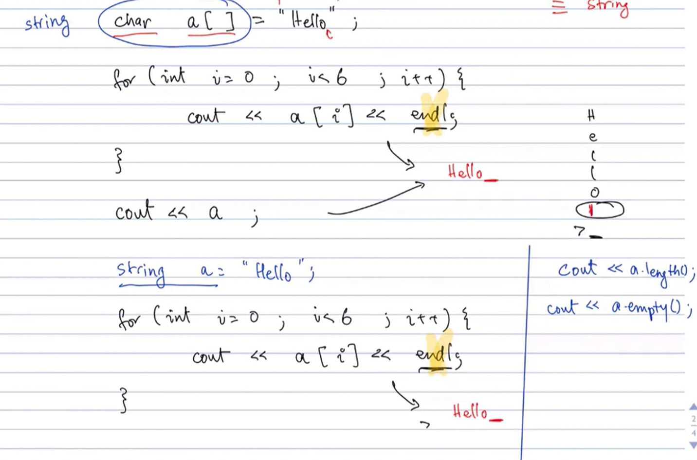
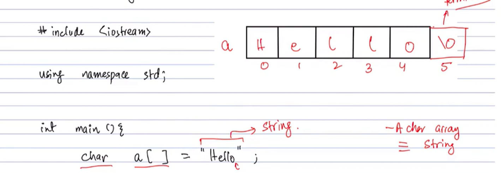
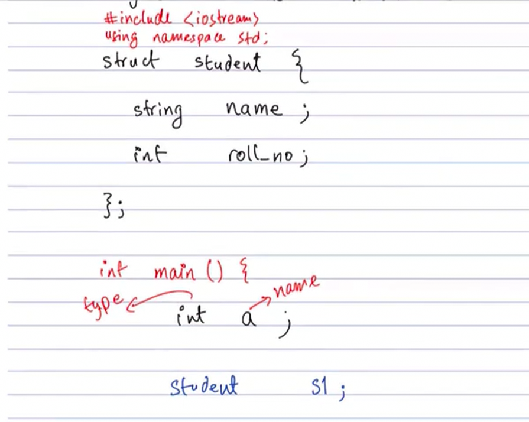
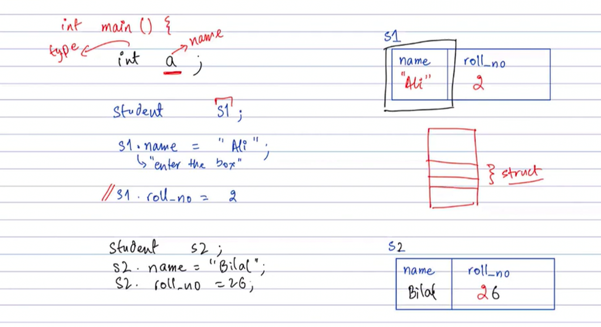
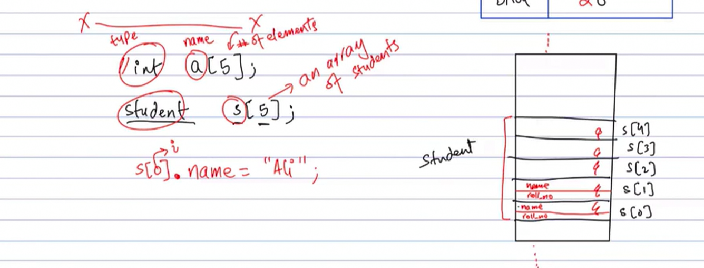
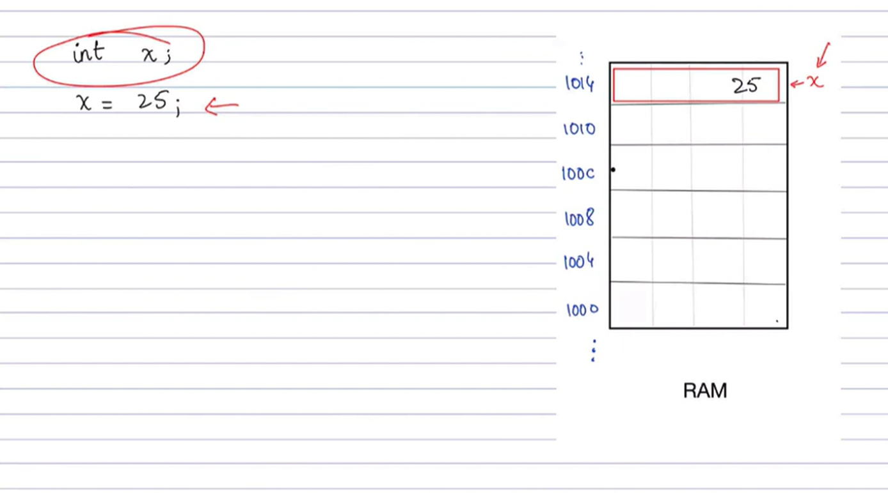

# Arrays, Strings, and Structs in C++

This C++ program demonstrates fundamental concepts in C++ programming: arrays (1D and 2D), strings (both C-style char arrays and std::string), and structs. It's part of a series on Object-Oriented Programming in C++.

## Overview

The program consists of several test functions that illustrate how to work with different data structures in C++. It covers:

- One-dimensional arrays
- Two-dimensional arrays
- Character arrays and strings
- User-defined structures (structs)

## Code Structure

### Main Components

1. **array_test()**: Demonstrates 1D array initialization and manipulation
2. **array_test2d()**: Shows 2D array operations
3. **string_test()**: Illustrates string handling with both char arrays and std::string
4. **Student struct**: A simple structure to represent student data
5. **main()**: Entry point that runs the string test and demonstrates struct usage

## Detailed Explanations

### 1D Arrays

The `array_test()` function shows how arrays are initialized and used:

```cpp
void array_test() {
    int a[5];

    cout << "Before assignment\n";
    for(int i = 0; i < 5;i++) {
        cout << a[i] << " "; // Notice the garbage values
    }
    // ... rest of the function
}
```



This function demonstrates that uninitialized arrays contain garbage values and how to properly initialize them.

### 2D Arrays

The `array_test2d()` function demonstrates two-dimensional arrays:

```cpp
void array_test2d() {
    int a[2][3];
    // ... initialization and printing
}
```



### Strings

The `string_test()` function covers both C-style strings and C++ strings:

```cpp
void string_test() {
    char a[] = "Hello";
    cout << a << endl;
    // ... null terminator check

    string name = "mansoor";
    cout << name << endl;
    // ... string operations
}
```




### Structs

The program defines a `Student` struct and demonstrates its usage:

```cpp
struct Student {
    string name;
    int rollno;
};

Student s1;
s1.name = "mansoor";
s1.rollno = 1;
```





## Memory Concepts

The program also touches on memory layout concepts:



## How to Run

1. Compile the program:

   ```bash
   g++ main.cpp -o output
   ```

2. Run the executable:
   ```bash
   ./output
   ```

## Expected Output

When you run the program, you should see output demonstrating:

- String operations
- Struct data printing
- Array manipulations (if uncommented)

## Learning Objectives

This code helps understand:

- Array declaration and initialization
- Memory management in C++
- String handling differences between C and C++
- Struct definition and usage
- Basic I/O operations

## Notes

- Some test functions are commented out in main(). Uncomment them to see additional demonstrations.
- The program uses `std::string` which requires including `<string>` header (implicitly included via `using namespace std;`).

## Dependencies

- C++ compiler (g++, clang++, etc.)
- Standard library (included automatically)
