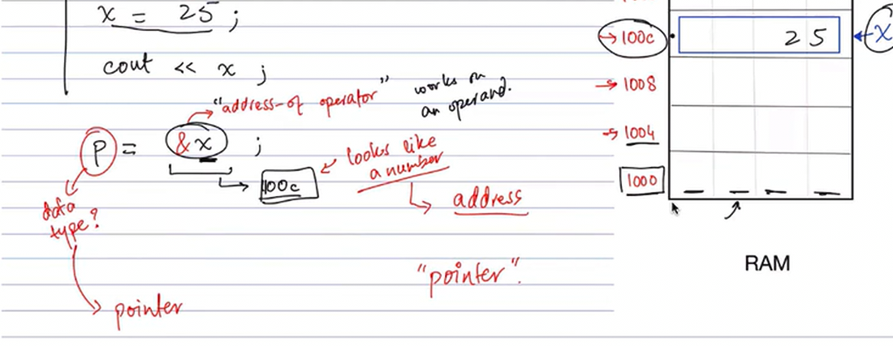
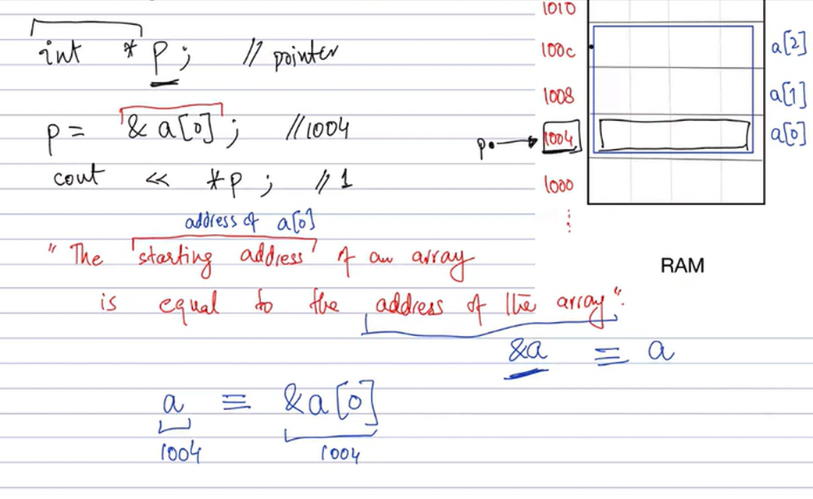
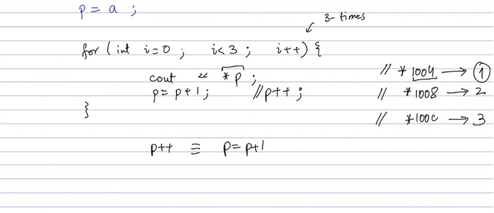
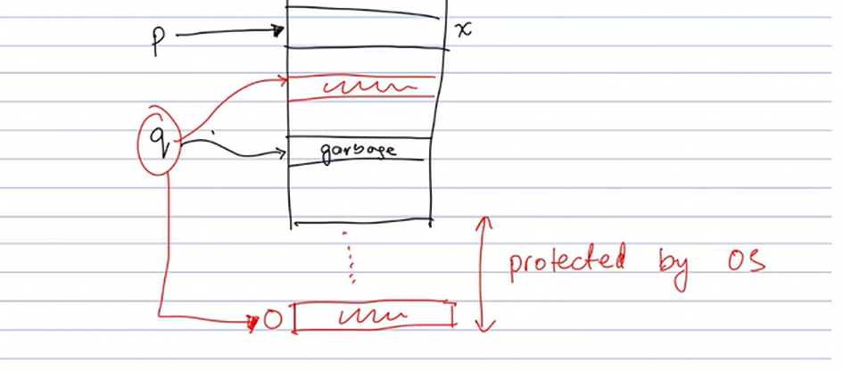
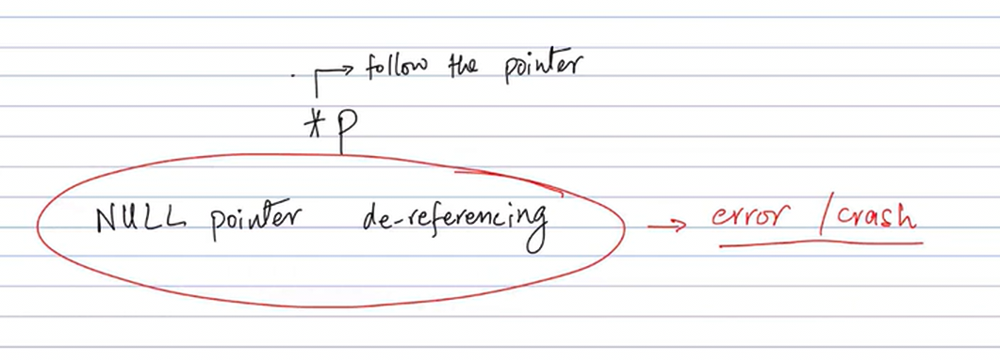

# Pointers in C++

This README explains the concept of pointers in C++ with examples and visual illustrations.

## What is a Pointer?

A pointer is a variable that stores the memory address of another variable. Pointers allow direct manipulation of memory, which is powerful but requires careful handling to avoid errors.

### Basic Pointer Operations

Consider the following code snippet:

```cpp
int x = 25;
int *p; // integer pointer
p = &x;

cout << "Value of x itself: " << x << "\n";
cout << "Value of address of x: " << &x << "\n";
cout << "Value of p itself: " << p << "\n";
cout << "Value of *p: " << *p << "\n";
```



This image shows:

- `x` contains the value 25
- `&x` gives the memory address of x
- `p` stores the address of x
- `*p` dereferences the pointer to access the value at that address

### Pointers and Arrays

Arrays in C++ are closely related to pointers. The array name acts as a pointer to the first element.

```cpp
int a[] = {1,2,3,4};
int *p;
p = a; // no & needed
```



### Traversing Arrays with Pointers

You can use pointers to iterate through array elements by incrementing the pointer.

```cpp
for(int i = 0; i < 4; i++) {
    cout << "Value of p " << p << " ";
    cout << "Value of *p " << *p << " ";
    p++;
    cout << "\n";
}
```



Notice how the pointer `p` increments to point to the next element in each iteration.

### Null Pointers

A null pointer points to nothing. It's good practice to initialize pointers to NULL if they're not immediately assigned a valid address.

```cpp
int *q = NULL;
cout << "Value of q = " << q << "\n";
// cout << "Value of *q = " << *q << "\n"; // This would cause an error
```



Always check for NULL before dereferencing a pointer to avoid runtime errors.

### Technical Terms



Key terms related to pointers:

- **Declaration**: `int *p;` - declares a pointer to an integer
- **Assignment**: `p = &x;` - assigns the address of x to p
- **Dereferencing**: `*p` - accesses the value at the address stored in p
- **Address-of operator**: `&x` - gets the memory address of x
- **NULL pointer**: A pointer that doesn't point to any valid memory location

## Running the Code

Compile and run the `pointer.cpp` file to see these concepts in action:

```bash
g++ pointer.cpp -o pointer
./pointer
```

The code includes functions demonstrating basic pointers, array pointers, and null pointers. Uncomment the function calls in `main()` to test different aspects.
