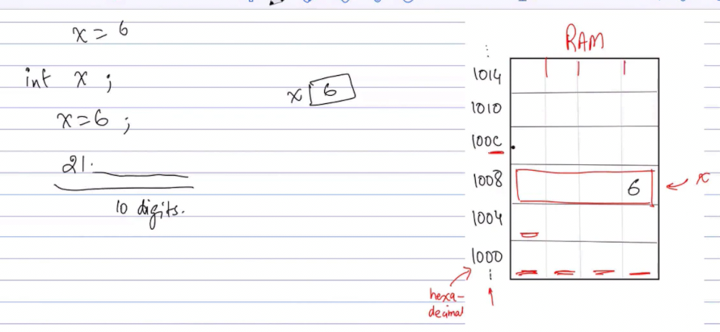
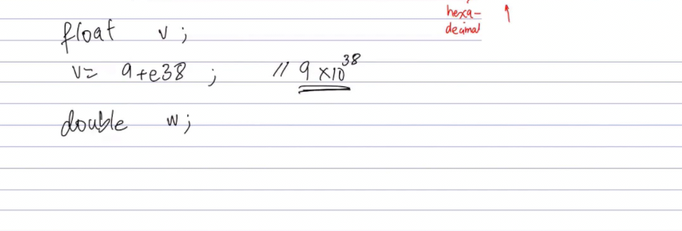
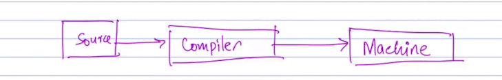

## Data types - Functions - Function prototypes

Basic intro to main function and library cout and return type etc

How variables are store in ram

This is for loing

Float and double

Functions

Here is a function prototype

Source code to compile and it generates machine code

